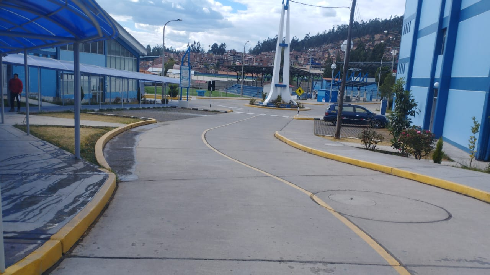

# ¡Hola! Encantado de conocerte. 

## ⭐ Sobre mí

Soy **Arquitecto de Soluciones Web & Cloud**, originario de 🇵🇪 **Ancash, Perú**, actualmente viviendo en 🏔️ **Huaraz, Áncash**. Me apasiona crear **sistemas escalables, seguras y orientadas a la innovación tecnológica**, aplicando **arquitecturas modernas, patrones de diseño y metodologías ágiles**.

**Formado como Ingeniero de Sistemas e Informática** en la Universidad Nacional Santiago Antúnez de Mayolo, con experiencia en **desarrollo de software, integración de sistemas y optimización en entornos Cloud**.

• 🌱 Actualmente aprendiendo...
  ○ Microservicios con Kubernetes
  ○ Arquitecturas Serverless
  ○ DevOps y CI/CD avanzado

 

## 🛠️ Tecnologías y Herramientas

---

## 🚀 Sobre mí
✔ **Arquitecto de Soluciones Web & Cloud**: Diseño arquitecturas escalables, optimizando rendimiento y seguridad.  
✔ **Experto en Desarrollo Full Stack**: Desde **React / Angular** en el frontend hasta **Node.js, Express y APIs REST** en el backend.  
✔ **Cloud & DevOps Enthusiast**: Experiencia con **AWS, Docker, CI/CD y microservicios**.  
✔ **Transformación Digital**: Implemento soluciones innovadoras alineadas a objetivos de negocio.  

---

## 📂 Proyectos destacados

| 📋 Proyecto | ⭐ Estrellas | 🍴 Forks | 📝 Descripción | 🚀 Estado |
|-------------|-------------|-----------|----------------|-----------|
| **[E-commerce Moderno](enlace-a-tu-repo)** |  |  | Tienda online con React y Node.js |  |
| **[Dashboard Analytics](enlace-a-tu-repo)** |  |  | Panel de control con visualización de datos |  |
| **[API REST Completa](enlace-a-tu-repo)** |  |  | API RESTful con autenticación JWT |  |

## 📖 Mis últimas publicaciones

• 📝 **[Cómo Estructurar tus Aplicaciones React](enlace-al-post)**  
  *Una guía completa sobre las mejores prácticas de arquitectura*

• 📝 **[Cómo Crear un README Autodidacta para tu Perfil de GitHub](enlace-al-post)**  
  *Un tutorial paso a paso para destacar en GitHub Actions*

• 📝 **[Consejos Pro para Comenzar con Git en tu Proyecto Personal](enlace-al-post)**  
  *Mejora tu flujo de trabajo con estas bases sólidas*

• 📝 **[¿Te Interesa una Oportunidad Única en tu Vida?](enlace-al-post)**  
  *Una posición perfecta para quienes buscan escribir para el día a día*

• 📝 **[Cómo Cuidar tu Marca Personal como Programador](enlace-al-post)**  
  *7 pasos para construir una presencia sólida en el ecosistema tech*

• 📝 **[7 Nuevas Características de ES2024](enlace-al-post)**  
  *Descubre las últimas funcionalidades de JavaScript*

## 📈 Estadísticas de GitHub

  

  

  

## 🌟 ¡Bienvenido a Perú! 🏔️ ¡Huaraz te espera!

  

*Arriba están las últimas 3 fotos compartidas de mi hermoso Perú*  
Actualmente, el clima está en **☀️ soleado**.  
Hoy, el sol sale a las **06:15** y se pone a las **18:30**.

## 🔗 Dónde encontrarme

---

  

  
**Este archivo README se genera automáticamente cada 3 horas!**  
*Última actualización: Domingo, 31 de Agosto de 2025*

---

  

